**PlaDat: a Software Development Process assignment 2** 

**Introduction to PlaDat and goal** 

PlaDat was born out of a **common need** of university and non-university students. 

Often, for reasons related to the curriculum of the course of study, for work requirements and/or for the desire you to put into practice the knowledge acquired and experiment, during the course of study students decide to **enter the world of work**. However, **school knowledge is not sufficient** to churn out professionally prepared workers, remaining at a higher level of **abstraction** than actually required, eclipsing **practice** behind theory. Although the latter is extremely  important  for  an  innovation-driven  world  such  as  ours,  teenagers,  with  little experience, must be able to tiptoe into the market, without pressure, and, above all, must have the opportunity to be able to show their skills in concrete, incremental steps. To ensure what has  just  been  enunciated  there  are  **internships**,  which,  as  Wikipedia [(https://en.wikipedia.org/wiki/Internship)](https://en.wikipedia.org/wiki/Internship)  points  out,  are  ad-hoc  paths  at  an  institution, public or private, of very variable duration, for the main purpose of learning and training, generally finalized in the entry of the job market. 

The difficulty, however, lies in **finding jobs that meet the expectations** of the young people and match with their school and/or university career. There are too many cases of **internships unrelated**  to  the  real  will  of  the  intern  himself,  making  an  important  opportunity  for professional and personal growth in vain, which risks, even more, to confuse the young person's ideas.  Too  many,  moreover,  are  the  **difficulties  of  accessing**  a  congruent,  single  list  of proposals that is not redundant and/or scattered among heterogeneous channels. We, the creators of PlaDat, were the first to encounter these difficulties during our university studies and were the first to see **a concrete need** for them, a need confirmed by our fellow students and by students from different faculties. In this context **we would like the** **Bicocca University of Milan** [(https://www.unimib.it/),](https://www.unimib.it/) as a young university attentive to the needs of its members, to **fund our project**, which is why in our study we will consider it as the one commissioning the project. 

This is where PlaDat comes in: a **facilitator for bringing the two worlds together**. There are a number of platforms with similar purpose to PlaDat, but they are often outdated, complex, difficult to use or have little educational offerings. Often, moreover, these web apps encapsulate only **corporate** internships, excluding the whole slice of the market related to **teaching and research at public institutions**, an aspect that is often underestimated, but of fundamental importance for a growing country and for young people who want to approach this reality. 

PlaDat, therefore, proposes itself as a **single point of access for students of various levels to the world of work**, a platform that sees on one side students and on the other HR, for selection by private companies, and professors, for selection by research canters and universities. In Pladat: 

- **Institutions** will, therefore, have the chance to make themselves known, showcase their opportunities and attract the brightest students by viewing applications and updating their status. 
- **Students**, on the other hand, will be able to find offers that best suit their needs, train, grow and take their first steps into an unfamiliar world, all through a platform that highlights the key lines of their profile. They will, in addition, be able to make themselves known, showcase their skills and, why not, find future work. 

Finally, the platform will make it possible to **keep track of the evolution of applications,** taking users all the way to the first contact; after the latter, it will be up to the interested parties to do their best to convince themselves and begin a joint path. 

Pladat was created by **students for students**. 

**Stakeholder identification** 

A  crucial  and  **preliminary**  aspect  to  any  **elicitation  plan**  (set  of  knowledge  extraction techniques) is the **identification of stakeholders**. The stakeholder, according to the Project Management Institute (PMI -[ https://www.pmi.org/)](https://www.pmi.org/) is an individual, group, or organization, who may affect, be affected by, or perceive itself to be affected by a decision, activity, or outcome of a project. In PlaDat we identify **eight stakeholders**, starting from funders to users down to those who have minimal interest with the platform. We go, then, to define stakeholders based on their interest, role, skills, and power over the project, remembering that if successful, **it will be the Bicocca University, through its organs, that will commission and manage the project**: 

- **Internship Office** 

The **internship office** is the body within the university that is **responsible for the regulation and management of curricular and extracurricular internships** within the university. It communicates with: 

- **Students** for bureaucratic management of the relationship and to resolve issues as first-level Help Desk in the use of PlaDat. 
- **Lecturers**  for  the  bureaucratic  management  of  the  relationship  in  case  of research internships and to resolve issues as first-level Help Desk in the use of PlaDat. 
- **HR recruiters** for the bureaucratic management of the relationship in case of in- house internships and to resolve issues as first-level Help Desk in the use of PlaDat. 
- **Student Services staff** for coordination related only to internship aspects. 
- **Development Team** for coordination in the implementation of the platform. 
- **Data Protection Authority** in case of problems with the processing of users' personal data. 

Being the main coordinating body of the internship**, it is the funder**, on behalf of the university, of PlaDat and must be treated with an eye to it since, a lack of funding, would lead to the **failure of the project**: **economic decisions** with respect to the platform fall 

to him.  

- **Student Services staff** 

The **student services staff** are the organs of the university that **deal with issues that occur during students' university journey**. They communicate with: 

- **Students** for first-level Help Desk aspects related to the use of PlaDat and to assist them in organizing the internship. 
- **Internship Office** for coordination related only to internship aspects. 

Being a student support organization, they oversee communications with students and are, for this reason, one of the **main promoters of the platform**; however, they cannot be considered a stakeholder that could make the project fail, but it could slow down its dissemination.** 

- **Students** 

The **students** are those **who will use PlaDat** to search for curricular and extracurricular internships. They communicate with: 

- **Internship  office**  for  internship-related  bureaucratic  purposes  and  to  solve simple problems in using PlaDat. 
- **Student service staff** for help in organizing the internship and solving simple problems of using PlaDat. 
- **HR recruiters** for recruitment purposes in case of internships in companies. 
- **Lecturers** for recruiting purposes in case of search routes and to agree on an appropriate training plan. 
- **Development team** to solve complex problems of using PlaDat. 

Since they, along with Lecturers and HR recruiters, they constitute the **end users of the platform**, they are to be **consulted and kept informed** as the project evolves to gather feedback and incrementally improve it according to their needs. Failure to pay adequate attention to their tastes and needs could result in the **later failure of PlaDat**: their non- use of the web application would imply its futility. In fact, PlaDat was created precisely around their needs, to support them in choosing an internship that is stimulating and in 

line with their expectations. 

- **Lecturers** 

The **lecturers** are those who represent **research institutions and universities in the selection** of students; the use of PlaDat would facilitate, to them, the initial aspects of selecting good candidates. They communicate with: 

- **Students** for recruiting purposes in case of search routes and to agree on the training plan.** 
- **Office stage** for the bureaucratic management of the relationship in case of in- house internships and to resolve simple problems in using PlaDat.** 
- **HR recruiters** to collaborate in choosing the teen's educational plan during the internship  period  and  to  receive  description  of  some  opportunities  to  be exhibited during classes related to the content of the proposal.** 
- **Development team** to solve complex problems of using PlaDat.** 

Since they, along with HR recruiters and students, are the **end users of the platform**, they are to be **consulted and keep informed** during the evolution of the project to gather feedback and improve it incrementally according to their needs. Failure to pay adequate attention to their tastes and needs could lead to a  **subsequent failure of PlaDat**: their non-use of the web application would imply a scarce amount of proposals for  students  to  submit,  which  would  reduce  the  variety  of  choice  and,  cascadingly, dissatisfaction on the part of students with internship proposals, an aspect that should counteract PlaDat. In addition, faculty, **represent the part of educational offerings related to public research**, a lack of them would restrict the part of the market chosen by students whose interest is to make a career in that field. Lecturers, moreover, are strong promoters for PlaDat as they will **often be the promoters** of the same to the parties.** 

- **HR recruiters** 

The  **HR  recruiters**  are  responsible  for  **hiring  new  candidates  for  companies**, representing  the  company  within  PlaDat.  Using  PlaDat  allows  recruiters  an  easier selection of good candidates. They communicate with: 

- **Students** for recruitment purposes. 
- **Lecturers** to collaborate in choosing the teenager’s educational plan during the internship period and to ask for "sponsorship" of the opportunity during classes related to the content of the proposal. 
- **Internship Office** for bureaucratic purposes and in case of simple problems in using PlaDat. 
- **Development Team** in case of problems with using PlaDat. 

Since they, along with Lecturers and students, are **the end users of the platform**, they are to be **consulted and kept informed** as the project evolves to gather feedback and incrementally improve it according to their needs. Failure to pay adequate attention to the tastes of HR recruiters and their needs could result in a **subsequent failure of PlaDat**: their non-use of the web application would imply a scarce amount of proposals for  students  to  submit,  which  would  reduce  the  variety  of  choice  and,  cascadingly, dissatisfaction on the part of students with internship proposals, an aspect that should counteract PlaDat. Moreover, HR recruiters, represent  **the part of the educational offerings related to private companies**, a lack of them would restrict the part of the market chosen by students whose interest is to make a career in that sector.** 

- **Data Protection Authority** 

The  **Data  Protection  Authority**  is  an  independent  Italian  administrative  authority established to ensure the **protection** of fundamental rights and freedoms and respect for dignity in the processing of **personal data**. It communicates, where appropriate, 

with:** 

- **Internship Office** in case of problems with the processing of users' personal data. 
- **Development** **team** in case of problems with the processing of users' personal data. 

Since it is a guarantor body and external to the reality in question, it **has no interest in either the failure or success of the project**, it simply ensures that the personal data of users (faculty, hr recruiters and students) are respected. As a result of what has been pointed out, it is not to be consulted for application implementation aspects, but it is to be taken into consideration: should any regulations related to its perimeter be violated, it **could intervene, causing PlaDat to fail**.** 

- **Development Team** 

The  **development  team**  (we)  is  the  stakeholder  that  provides  the  **skills  for  the implementation**  of  PlaDat.  It  is  responsible  for  the  proper  implementation  of  the application  requirements  and  for  meeting  all  the  heterogeneous  needs  of  the stakeholders, however difficult it may be. It communicates with: 

- **Students** to resolve issues as a second-level Help Desk. 
- **Lecturers** to resolve issues as a first and second-level Help Desk. 
- **HR recruiters** to resolve issues as a second-level Help Desk. 
- **Data  Protection  Authority**  in  case  of  issues  with  users'  personal  data 

management. 

- **Office stage** for coordination in the implementation of the platform. 

Being the stakeholder who designs the application, **it is the basis of its success**, his knowledge and ability to pander to the needs and meet the standards will ensure, or not, its growth. A team composed of junior, creative and innovative, and senior, experienced and  meticulous  figures  could  be  a  good  compromise  to  ensure  the  success  of  the application. 

- **Competitors** 

The **competitors** are **the rivals of our application**, entities that develop competing platforms or that, for some disparate reason, hold back the success of the project. By this term, then, we group all stakeholders who have a stake in the failure of PlaDat. They are neither  developers,  nor  funders,  nor  users  of  our  project,  so,  certainly,  they  are  of marginal importance, but they are to be considered: analysing their products or their criticisms  **could  help  PlaDat  to  grow**  and  stay  ahead  of  the  curve.  Importantly, observing their platforms allows us to gain useful information to improve our web app: in the background study of the elicitation plan, some of them will be analysed.  

Importantly, at this stage of identifying stakeholders, we did not simply want to highlight their role within PlaDat, but also their **relationship** and the **iteration** they have, which can also positively or negatively influence PlaDat's growth. 

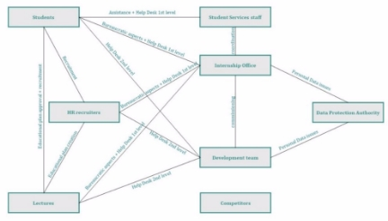

Let us go, finally, to analyze stakeholders from a point of view of **importance in the elicitation plan**, going to personalize the **strategy**: considering the interests of stakeholders is onerous, consequently  it  is  good  to  understand  towards  which  to  direct  more  energy.  To  **classify** stakeholders, we consider: 

- Their **power** they have in the project. 
- Their **interest** in the success of PlaDat. 

|**Power** |**Interest** |**Strategy** |
| - | - | - |
|**High** |**High** |They are the **most important** and must be highly satisfied. |
|**High** |**Low** |They are to **be kept satisfied** without filling them with information about operation. |
|**Low** |**High** |They are to be **kept informed and need to be consulted** regularly to understand how to make the system work. |
|**Low** |**Low** |He will be given **general information**. |

Let us **summarize**, then, in a  table the importance of stakeholders  extrapolated from the analysis done earlier: 

**Power/Interest  High  Low **

|**High** |Internship Office e Development Team. |Data Protection Authority. |
| - | :- | - |
|**Low** |Students, Lecturers e HR recruiters. |Student Services staff. |

**Competitors** are **not summarized** in this table because they are marginal to the pure interests of the project. We can, therefore, move on to the information elicitation stage.** 

**A short introduction to Requirements Engineer and Elicitation process** 

**Requirements  engineering**  is  the  process  of  **defining,  documenting  and  maintaining** **requirements**  in  engineering  design  processes [(https://en.wikipedia.org/wiki/Requirements_engineering),](https://en.wikipedia.org/wiki/Requirements_engineering) processes that attempt to solve **real-world problems**. Engineers examine a range of data about the goals and objectives of the software: how it will work and what qualities of properties it must have to achieve the design goals. Importantly, much of requirements engineering deals with the **stakeholders** or parties involved in the process, i.e., the (previously identified) stakeholders, precisely to design the system based on their needs, ensuring its success. 

The **elicitation process** is the **first step** when engineering requirements, which can be defined as the **practice of researching and discovering the requirements of a system** from users, customers, and other stakeholders [(https://en.wikipedia.org/wiki/Requirements_elicitation).](https://en.wikipedia.org/wiki/Requirements_elicitation) An effective elicitation process is important for product teams to realize the following **benefits**: 

- **Lower project costs** by catching requirements problems before development begins, 
- **Increase the likelihood** that users and customers get what they want, 
- **Reduce the risk of project failure**, 
- ... 

It is important, in any case, to **preliminarily analyze** stakeholders, objectives, competitors, and the application domain, all to engage stakeholders only after they are properly prepared and thoroughly understand how to interact with them to **properly elicit information** from them. We will enter, next, into the details of what processes and elicitation methods we used for PlaDat. 

**Our workflow** 

Having reached this point, having analyzed stackholders and having contextualized the meaning of elicitation, we can move on to describe the PlaDat workflow: 

1. The first step we will carry out is a background study to understand the context in which PlaDat fits. This is preliminary to the actual interaction with stakeholders to ensure we have useful knowledge, as previously explained, to gather contextualized feedback and outline an initial set of requirements. In this section, in fact, we will analyze the main competitors of our platform, attempting to extrapolate the requirements that best relate to the system. Also, since PlaDat needs to be funded by the Bicocca University of Milan, we will attempt to derive preliminary information about the organization and analyze the domain in which our web-app fits (standards, ...). In brief: 
1. We will analyze the competitors, the domain as a whole and the organization (Bicocca University of Milan), 
1. We will draft an initial set of functional and non-functional requirements. 

By analyzing the stakeholders, in the previous step, we were able to assign them a priority, which, in this second step, comes in handy. Interacting with them, in fact, is very onerous and complex; consequently, we are going to interface only with those who possess a higher priority, inherent to the project, and, in particular, for the PlaDat analysis, due to timing issues, we will limit ourselves to HR recruiters and university students. In this way, among other things, we will  limit  contradictory  information  and  communication  obstacles  that  might  arise  from listening to stakeholders with lower priority. 

2. The second step we will carry out will be the creation, administration and analysis of an HR  recruiter  interview,  a  stakeholder-driven  technique  that  uses  iteration  with stakeholders as the main elicitation tool. The idea is to be able, through a meeting, in our case semi-formal, to confirm and extract information necessary to create an application useful for collecting contextualized candidate data, with the purpose of assessing their profile. Since recruiters, in fact, will be the ones to request the students' information for the purpose of initiating the training, we thought of submitting the interview prior to the generation of the student questionnaire, so as to customize the latter according to the needs of human resources. The core functionality of PlaDat will, in fact, be strongly dictated by the needs of the latter, while from the students we will extract information more related to user-experience. 

The rationale for using interviewing as an elicitation technique for this activity lies in the  need  to  ensure  more  discussion  about  the  PlaDat  domain,  thanks  to  a  mix  of structured interviewing, in which we will submit specific questions generated by the background study, and unstructured interviewing, to gather insights from us that are not evaluated, which we could not do through a questionnaire. In brief: 

1. We will create the structured interview part based on the background study, 
1. We will administer the interview (not conducted as a two-person group), 
1. We will analyze the results of the interview to draw requirements from it (not done as a two-person group). 
3. The third step we will carry out will be the creation, administration and analysis of a questionnaire  to  be  submitted  to  students,  an  artifact-driven  technique  that  uses artifacts  as  the  main  elicitation  tool.  The  idea  is  to  be  able,  through  closed-ended questions,  to  confirm  and  extract  information  needed  to  create  a  student-friendly application. Since the latter will be the ones to actively use the platform that is, among other things, built around their needs, we thought of customizing the user-experience precisely according to them. Moreover, it will always be the students who will have to provide the data necessary for selection, which is why they will be asked questions about how to do it (note the "how to do it," not what to administer that has, instead, already been selected by the HR recruiter interview). 

The rationale for using the questionnaire as an elicitation technique lies in the need to target questions to a large pool of students, in order to be able to get feedback for PlaDat customization that is the result of the opinion of a large number of people, which is not possible  with  the  interview.  In  addition,  by  using  this  technique,  we  have  the opportunity to submit questions whose answers leave no room for interpretation, due to the inherent objectivity of the questionnaire, allowing us to draw more concrete and contextualized information given the heterogeneity of the students. In brief: 

1. We will create the questionnaire based on the background study and interview, 
1. We will administer the questionnaire (despite being a two-person group), 
1. We will analyze the results of the interview to draw requirements from it (even though we are a two-person group). 

We will summarize the steps just described in a diagram: 

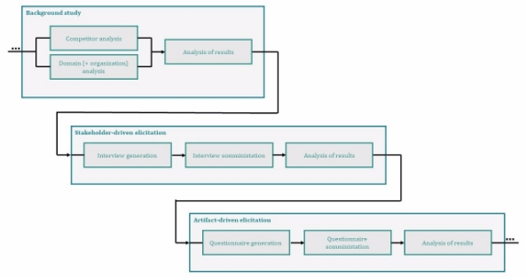

**!**: We preferred, although it was not required, to prepare both an interview and a questionnaire to get as close as possible to a real case.** 

**Background study** 

As previously highlighted, the background study allows us to understand the domain in which PlaDat  operates,  to  ensure  we  have  the  useful  knowledge  to  interface  with  stakeholders, understand the goals of the application and extract the first requirements. Moreover, we use it, in our case, to go and learn about the reality that should, if all goes as planned, fund the project, namely the University of Milano Bicocca. 

Let us begin by re-emphasizing the basic features and purpose of PlaDat. PlaDat was created as a facilitator to unite the corporate world and the student world, an access point for students to the working reality. The web app sees on one side the students and on the other side HR recruiters, representing private companies, and faculty, representing research centers, who are to offer training internships to the students. As outlined in the objectives, in PlaDat: 

- Institutions have a chance to make themselves known, show their opportunities and attract students, 
- Students can find the offers best suited to their needs, train, grow, and take their first steps in an unfamiliar world, all through a platform that highlights the key lines of their profile.  

Finally, the web-app makes it possible to follow the evolution of applications, accompanying users up to the first contact. The field of students who can take advantage of the platform, however,  although  ideally  very  broad,  in  this  first  release  the  application  is  restricted,  as already pointed out, to Bicocca students only, as an eventual funder of PlaDat. 

After  re-contextualizing  PlaDat,  we  turn  to  an  analysis  of  the  Competitors.  During  the background  study  we  found  two  main  competitors  of  PlaDat:  Tutored [(https://www.tutored.me/)](https://www.tutored.me/) and the internship portal of Bicocca University in Milan (https: [https://s3w.si.unimib.it/)](https://s3w.si.unimib.it/). 

- Tutored is the digital meeting point between university students, recent graduates and companies.  The  community  consists  of  young  people  who  get  in  touch  with  the companies active on the platform and start their professional careers. Ads for entry level positions and internships, smart webinars, challenges and coding battles are the content that companies create on Tutored to attract and hire the best college talent. To date, Tutored is primarily a leading recruiting and employer branding app, collaborating with more than 250 companies; but it does not only support the job placement of students and  recent  graduates:  it  also  offers  numerous  informative  webinars,  organized  in collaboration  with  companies  and  professionals  from  the  world  of  work,  and educational masterclasses, useful for acquiring basic skills and knowledge required by the job market. Information taken from: 
  - [https://opportunita.tutored.me/tutored-come-funziona, ](https://opportunita.tutored.me/tutored-come-funziona)
  - [https://www.linkedin.com/company/tutored/, ](https://www.linkedin.com/company/tutored/)
  - [https://www.luniversitario.it/2021/05/07/tutored-al-passo-coi-tempi01/. ](https://www.luniversitario.it/2021/05/07/tutored-al-passo-coi-tempi01/) 

- Internship Portal is a portal through which Milano Bicocca University provides support to registered students who want to activate a curricular internship. This platform allows the search of offers from companies registered and affiliated with the university and the application and them by the student. Information taken from: 
  - [https://www.unimib.it/servizi/stage-e-tirocini/stage-e-tirocini-curriculari;](https://www.unimib.it/servizi/stage-e-tirocini/stage-e-tirocini-curriculari) 
  - [https://www.unimib.it/servizi/bicocca-orienta/servizi-orientamento/stage-e- tirocini/studenti/ricercacandidatura-offerte-stagetirocinio.](https://www.unimib.it/servizi/bicocca-orienta/servizi-orientamento/stage-e-tirocini/studenti/ricercacandidatura-offerte-stagetirocinio) 

Pladat has a role that lies somewhere between the two platforms: as functional as Tutored, but as simple as the Internship Portal. As already highlighted: 

- It allows searching and applying for curricular and extracurricular internships, 
- Has a simple functional student-friendly interface, 
- Is accessible via university account, 
- It manages research and external internships in the company. 

Let  us,  at  this  point,  go  through  an initial  list  of  functional  requirements drawn  from  the background study, i.e., requirements indicating PlaDat's functionality or services, i.e., the inputs and outputs of the system.  

To document the requirements we use natural language, which allows infinite expressions to be defined, but restricted, to reduce ambiguity, by using local rules. With this in mind, we created an ad-hoc template for the requirements in our document. 

|**ID** |Unique requirement identifier consisting of typeRequirement-functionality-typeUser. |
| - | :- |
|**Type** |Functional requirement/Non-functional requirement. |
|**Description** |Description of the requirement. |
|**Priority** |Priority in implementation (High/Medium/Low). |
|**To Verify** |Indicates whether an aspect or the requirement in its interest are to be subjected to direct elicitation with stakeholders (Yes/No). |

List of **functional requirements**: 

|**ID** |Functional-Login-GenericUser |
| - | - |
|**Type** |Functional Requirements |
|**Description** |Users must be able to log into the application. |
|**Priority** |High |
|**To Verify** |Yes, ask students for access preferences. |

|**ID** |Functional-Registration-Student |
| - | - |
|**Type** |Functional Requirements |
|**Description** |Students must be able to sign into the application. |
|**Priority** |High |
|**To Verify** |Yes, ask recruiters for the data needed to analyse the student profile. |

|**ID** |Functional-ViewProfile-GenericUser |
| - | - |
|**Type** |Functional Requirements |
|**Description** |Users must be able to view their profile. |
|**Priority** |Middle |
|**To Verify** |No |

|**ID** |Functional-DeleteProfile-GenericUser |
| - | - |
|**Type** |Functional Requirements |
|**Description** |Users must be able to delete their profile. |
| - | - |
|**Priority** |Middle |
|**To Verify** |Yes, ask users if they need time to reconsider. |

|**ID** |Functional-Registration-Recruiter |
| - | - |
|**Type** |Functional Requirements |
|**Description** |Recruiters must be able to sign into the application. |
|**Priority** |High |
|**To Verify** |No |

|**ID** |Functional-UpdateProfile-Student |
| - | - |
|**Type** |Functional Requirements |
|**Description** |Students must be able to update their profile. |
|**Priority** |Low |
|**To Verify** |No |

|**ID** |Functional-UpdateProfile-Recruiter |
| - | - |
|**Type** |Functional Requirements |
|**Description** |Recruiters must be able to update their profile. |
|**Priority** |Low |
|**To Verify** |No |

|**ID** |Functional-ViewOtherProfile-Student |
| - | - |
|**Type** |Functional Requirements |
|**Description** |Students must be able to view recruiter-profiles. |
|**Priority** |Middle |
|**To Verify** |Yes, ask students if they want to see data in a structured format. |

|**ID** |Functional-ViewOtherProfile-Recruiter |
| - | - |
|**Type** |Functional Requirements |
|**Description** |Recruiters must be able to view student-profiles. |
|**Priority** |Middle |
|**To Verify** |Yes, ask recruiters if they want to see data in a structured format. |

|**ID** |Functional-SearchOffers-Student |
| - | - |
|**Type** |Functional Requirements |
|**Description** |Students must be able to search offers. |
|**Priority** |High |
| - | - |
|**To Verify** |Yes, ask students what kind of filter they want to have. |

|**ID** |Functional-ViewOffer-Student |
| - | - |
|**Type** |Functional Requirements |
|**Description** |Students must be able to view the information of an offer. |
|**Priority** |High |
|**To Verify** |Yes, ask students if they want to see data in a structured format. |

|**ID** |Functional-ViewOffers-Student |
| - | - |
|**Type** |Functional Requirements |
|**Description** |Students must be able to view which offers they applied and the status. |
|**Priority** |High |
|**To Verify** |No |

|**ID** |Functional-ApplyOffer-Student |
| - | - |
|**Type** |Functional Requirements |
|**Description** |Students must be able to apply to an offer. |
|**Priority** |High |
|**To Verify** |Yes, ask students if they want automatic CV generation and recruiters what data are needed from students. |

|**ID** |Functional-CreateOffer-Recruiter |
| - | - |
|**Type** |Functional Requirements |
|**Description** |Recruiters must be able to create an offer. |
|**Priority** |High |
|**To Verify** |Yes, ask students what data they want to have on the offer. |

|**ID** |Functional-ViewOffer-Recruiter |
| - | - |
|**Type** |Functional Requirements |
|**Description** |Recruiters must be able to view the information of an offer and who applied. |
|**Priority** |High |
|**To Verify** |Yes, ask recruiters if they want to see data in a structured format. |

|**ID** |Functional-ViewOffers-Recruiter |
| - | - |
|**Type** |Functional Requirements |
| - | - |
|**Description** |Recruiters must be able to view their offers. |
|**Priority** |High |
|**To Verify** |No |

|**ID** |Functional-UpdateOffert-Recruiter |
| - | - |
|**Type** |Functional Requirements |
|**Description** |Recruiters must be able to update their offers. |
|**Priority** |Low |
|**To Verify** |No |

|**ID** |Functional-CloseOffer-Recruiter |
| - | - |
|**Type** |Functional Requirements |
|**Description** |Recruiters must be able to close their offers. |
|**Priority** |Middle |
|**To Verify** |Yes, ask students if recruiters have to give answers before closing offers |

|**ID** |Functional-UpdateStatus-Recruiter |
| - | - |
|**Type** |Functional Requirements |
|**Description** |Recruiters must be able to update the status of a student's application. |
|**Priority** |High |
|**To Verify** |No |

In addition, analyzing the competitors from a performance-related perspective, we studied the performance and SEO, i.e., the set of strategies and practices aimed at increasing visibility in search engine rankings, of the two platforms. To do this, we used an ad-hoc web-app, namely GTmetrix  [(https://gtmetrix.com/),](https://gtmetrix.com/)  one  of  the  most  popular  tools  for  analyzing  a  site's performance. The result of the analysis is a GTmetrix grade, an assessment of the overall page performance. It reflects, both, how fast the page loaded for users, and how well it's built for performance, based on indicators drawn from: 

- Google's speed score: PageSpeed, 
- Yahoo's speed score: YSlow, 
- the full page load time, 
- the total weight of the page, 
- the number of requests. 

The result was as follows: 

- Tutored 

- Internship Portal  

The results are strongly different, but to be competitive in the market, we decided that the performance in our site must exceed or equal a GTmetrix grade equal to B, equal to the highest grade obtained by the two sites.  

At this point, since PlaDat is placed in a European context, we focused on analyzing the current standards.  From  this  study,  the  European  standard  2016/679,  namely  the  **General  Data Protection Regulation** (GDPR - https://www.garanteprivacy.it/regolamentoue), stands out. It establishes  strict  global  privacy  requirements  for  companies  offering  services  in  the  EU, regulating how individuals' personal data are processed and protected. Simply put, it states that individuals' choices with respect to their own data must be respected, regardless of where it is sent, processed or stored. In PlaDat, therefore, we must comply with all the standards required by GDPR (*there are many, we will include a few*): 

- Data saved using high cryptographic standards such as AES-256, 
- Access to the site via HTTPS, which reduces the risk of data theft if the transmission is intercepted, 
- Network infrastructure must be redundant to ensure operation in case of failure. 

Finally, we collected and analyzed some aspects that our platform must have in order to ensure high quality standards: 

- Accessibility 

Accessible software is software that runs independently of the hardware system in use. Web-apps  such  as  PlaDat  break  down  this  barrier  as  they  are  independent  of  the underlying physical system and reachable from all devices with Internet access. The only problem is related to the obsolescence of devices and the screen size of those devices; to overcome this, the web-app will have to be responsive, i.e., structured in such a way that it adapts to any type of screen. Information taken from: 

- [https://www.w3.org/standards/webdesign/accessibility. ](https://www.w3.org/standards/webdesign/accessibility) 
- Availability, scalability and security 
  - Availability 

Availability refers to the ability of a system to cope with any interruption and to process information continuously.  Availability represents the amount of time the system remains online relative to the total time. Information taken from: 

- [https://it.wikipedia.org/wiki/System_availability. ](https://it.wikipedia.org/wiki/System_availability)
- Scalability 

Scalability  denotes  the  ability  of  a  system  to  scale  up  or  down  resources  as needed and available. Going into the term technically, we refer specifically to load scaling, which is the ability of a system to increase its performance if the demands on that system increase.  Information taken from: 

- [https://en.m.wikipedia.org/wiki/Scalability. ](https://en.m.wikipedia.org/wiki/Scalability)
- Security 

Secure  software  is  software  structured  in  such  a  way  as  to  decrease vulnerabilities, i.e., among other things, storing data properly and in line with GDPR (explained above). Information taken from: 

- [https://www.cybersecurity360.it/soluzioni-aziendali/la-sicurezza- informatica-nello-sviluppo-del-software-le-buone-regole-da-seguire/.](https://www.cybersecurity360.it/soluzioni-aziendali/la-sicurezza-informatica-nello-sviluppo-del-software-le-buone-regole-da-seguire/) 

The  application  must,  therefore,  be  developed  using  cloud-computing  principles [(https://it.m.wikipedia.org/wiki/Cloud_computing),](https://it.m.wikipedia.org/wiki/Cloud_computing) which: 

- Ensures high availability since an application is often located on multiple servers in different data centers around the world. This approach makes it possible to keep the application available no matter what, even in the event of unpreventable disasters at the locations where the data centers are located, but also easily accessible remotely at any time and from any place. 
- Ensures  high  scalability  as,  in  case  of  peaks  in  processing  capacity  or  rapid increase  in  resources,  leveraging  automated  systems  such  as  Kubernetes,  a portable,  extensible  and  open-source  platform  for  managing  containerized workloads and services. 
- Ensure  high  system  security  as  they  usually  implement  based  on  the  latest security, encryption and threat prevention standards.  

Authentication management systems should  also be provided to ensure  continuous (usability) and secure use of the platform.Andiamo, a questo punto, a stilare un primo elenco di requisiti non funzionali tratti dal background study, ovvero requisiti indicanti le i vincoli e le proprietà caratteristiche di PlaDat. 

To do this we use, once again, the previously introduced template. List of **non-functional requirements**: 

|**ID** |NonFunctional-Performance-GTmetrixGrade |
| - | - |
|**Type** |Non Functional Requirements |
|**Description** |To ensure competitiveness and performance, the application must exceed or equal GTMetrix grade B. |
|**Priority** |Middle |
|**To Verify** |No |

|**ID** |NonFunctional-Compliance-HTTPS |
| - | - |
|**Type** |Non Functional Requirements |
|**Description** |To align with the European GDPR standard, PlaDat must provide access via HTTPS. |
|**Priority** |High |
|**To Verify** |No |

|**ID** |NonFunctional-Compliance-AES256 |
| - | - |
|**Type** |Non Functional Requirements |

|**Description** |To align with the European GDPR standard, PlaDat must provide AES-256 symmetric data encryption. |
| - | :- |
|**Priority** |High |
|**To Verify** |No |

|**ID** |NonFunctional-Compliance-Redundancy |
| - | - |
|**Type** |Non Functional Requirements |
|**Description** |To align with the European GDPR standard, PlaDat must have the data rooted on at least two servers. |
|**Priority** |High |
|**To Verify** |No |

|**ID** |NonFunctional-Accessibility-Responsive |
| - | - |
|**Type** |Non Functional Requirements |
|**Description** |To ensure adequate accessibility, I create software that is responsive for the devices that will be used. |
|**Priority** |High |
|**To Verify** |Yes, ask students and recruiters what devices they access from and what browsers they use. |

|**ID** |NonFunctional-Accessibility-DistributedSystem |
| - | - |
|**Type** |Non Functional Requirements |
|**Description** |The at least two servers defined by the NonFunctional- Compliance-Redundancy requirement must be deployed in two different locations to avoid the problems associated with disasters. |
|**Priority** |Middle |
|**To Verify** |No |

|**ID** |NonFunctional-Availability-LoadBalancing |
| - | - |
|**Type** |Non Functional Requirements |
|**Description** |To ensure adequate availability, we need to create software that rests on Kubernates. |
|**Priority** |Middle |
|**To Verify** |No |

|**ID** |NonFunctional-Usability-SessionAuthentication |
| - | - |
|**Type** |Non Functional Requirements |
|**Description** |To ensure adequate usability, we need to create software that makes statefull HTTPS for authentication. |

|**Priority** |High |
| - | - |
|**To Verify** |No |
As a last aspect, we analyze the organization to which we propose funding, the same one in which we launch the first version of PlaDat. The University of Milano Bicocca is an Italian state university  founded  in  1998  that  was  founded  with  a  specific  mission,  as  the  LinkedIn description says, to make research the strategic foundation of all institutional activity. Today, the University of Milan-Bicocca is a multidisciplinary university that trains professionals in different  fields:  economic-legal,  scientific-technological,  medical,  sociological-statistical, psychological and pedagogical.  

Information taken from: 

- [https://it.linkedin.com/school/university-degli-studi-di-milano-bicocca/; ](https://it.linkedin.com/school/university-degli-studi-di-milano-bicocca/)
- [https://it.wikipedia.org/wiki/Universit%C3%A0_degli_Studi_di_Milano-Bicocca. ](https://it.wikipedia.org/wiki/Universit%C3%A0_degli_Studi_di_Milano-Bicocca)

To understand the context and who we will need to interface with in the organization, we analyzed the stakeholders and their iterations, which can be summarized in the following 

table (*already presented*).

It is important to point out that the mission and organization as a whole of the University of Milan Bicocca are to be strongly considered since PlaDat, as repeatedly stressed, will fit into this reality. Since we want, moreover, to obtain funds from the university, we have decided to administer a questionnaire to students that will, among other things, allow them to convince Bicocca to invest monetary resources on the basis of the concrete interest of its members. The questionnaire, then, has as a secondary objective to probe the needs, not extracted from the background study, of its users: the students. This elicitation technique was selected because of the need to receive extensive but structured feedback that is not free to interpret. On the other hand, with regard to the requirements analysis whose direct stakeholders are the recruiters, we will use an interview mode to allow for greater customization and gather ample useful insights.** 

**Stakeholder-driven elicitation: the interview** 

The  interview  is  the  second  step  in  our  elicitation  workflow.  It  is  a  stakeholder-driven technique  that,  as  previously  highlighted,  uses  iteration  with  stakeholders  as  the  main information-gathering tool. An attempt is then made, through a semi-formal meeting, to extract contextualized information, in our case by interviewing an individual recruiter (due to time constraints), attempting to understand the requirements that PlaDat must fulfill to meet his or her needs and enable the success of the application. 

There are two types of interviews: 

- **Structured interview**, which is an interview in which the interviewer is asked a series of previously formulated specific questions; 
- **Unstructured interview**, which is a type of interview that does not involve selecting a set of questions in advance, but is based on a free discussion regarding the system.  

In our case, as is often the case, we will use a mix of the two strategies, to extract information from  predetermined  questions  on  the  one  hand,  and  leave  room  for  discussion  with  the respondent on the other hand. The interview is structured in **sections**, each of which has a first part of structured questions and a final unstructured question with the purpose of deepening the topic of the section. The interview is aimed, as anticipated above, at an individual HR who serves as a spokesperson for the two classes of stakeholders-faculty and HR, respectively-that is, those whose purpose is to hire students.  

The  interview  involves  an  initial  getting-to-know-you  phase,  which  allows  us  to  put  the interviewee at ease, ensuring a loose and open dialogue. This initial phase also gives us the opportunity to assess the interviewee's level of experience, providing us with a metric for assessing the interviewee's. 

- *Good evening name, first of all thank you for agreeing to contribute to PlaDat. Before we get into the meat of the discussion and about our innovative platform let's get to know each other. What company are you a spokesperson for?* 

The following question serves both to **put the respondent at ease and to understand the respondent's experience based** on the size of the company he or she works for: large companies make a stricter selection on employees and work more actively in recruitment. 

- *How many years have you been doing this work?* 

The following question aims to **understand the experience of the interlocutor**. A newly hired HR with no experience behind them may be unclear about the best intern search strategy, not allowing us to properly tailor the platform. 

- *What, if you don't mind me asking, is your educational qualification?* 

The following question has a purpose both to **put the respondent at ease and to understand whether the selection strategy** he or she uses has an academic basis; this would be preferable: a psychology graduate, for example, has a degree that allows him or her to make a more structured and informed selection. 

The next questions are part of a  **section dedicated to obtaining information regarding general  opinion  of  the  platform**,  understanding  the  limits  where  HR  needs  PlaDat,  and discovering new competitors. 

- *By definition, your work is based on finding new talent. What approach do you use to make selections? Do you make use of any particular platform?* 

The  following  question  aims  to  **understand  how  HR  works**.  In  particular,  we specifically  want  to  understand  whether  they  use  on  direct  contact  through communication channels such as email, or whether they use competitor platforms. In the latter case we could both draw information regarding new competitors and assess interest in a platform such as PlaDat. 

- *Do you feel that the selection strategy you use provides you with all the information you need to make trainee selections?* 

The following question seeks to **understand how satisfied the respondent** is with the selection strategy they use and, by extension, how willing they would be to actually use PlaDat. If an HR cannot get all the information they need with the current methodology they are more likely to use the services of the new platform. 

- *Do you have any additional observations that you consider important and would like to emphasize about what has been said so far?* 

The  following  question  **arises  with  the  goal  of  fostering  a  discussion**,  so  as  to extrapolate further general information.  

The **third section** is the heart of the interview and aims to customize PlaDat **based on the characteristics needed by an HR to search for qualified trainees**. The questions lead the interviewee to do an in-depth analysis and help us confirm or add requirements. 

- *PlaDat is a platform built on the basis of user needs. To do this, however, we need more information regarding what data you and your colleagues use to evaluate a profile. What is the most relevant information that determines the choice?* 

The following question is intended to **understand the details regarding the data to be used to select a profile** in order to customize, for example, student registration. 

- *In  addition  to  a  direct  candidate  search  method  with  the  characteristics  you  just mentioned, you would like to have the ability to see which candidates have viewed your proposal?*  

The  following  question  aims  to  **evaluate  the  addition  of  a  new  functional requirement**. Quite often, young people are afraid to apply to offers for which they do not feel they are a good fit; therefore, HR might be interested in checking the "displayed by" to contact them directly should they turn out to be in line with the offer. 

- *Would you like to be able to contact candidates directly before the interview? If the answer is yes, what communication channel would you use?* 

The following question aims to **understand whether the respondent would also like to  communicate  with  trainees  prior  to  interviews**  **and**,  if  so,  **through  which communication channel**, which, if a direct platform communication system is chosen, would lead to the emergence of a new functional requirement. 

- *Since it is important for an HR to be able to identify a candidate's information from his or her profile, how would you like to display the profiles of possible trainees: schematically or discursively?* 

The  following  question  is  aimed  at  **understanding  how  information  should  be presented**, whether in a **structured** way for faster analysis or **discursive**. 

- *PlaDat is a platform that aims to simplify the selection of highly qualified interns. Consider that it may be useful to allow application for an internship proposal only after filling out a test?* 

The  following  question  aims  to  **understand  whether  a  new  feature**  (the implementation of a skills assessment test) **turns out to be a good idea**. Only if it turns out  to  be  an  interesting  proposition,  in  fact,  would  we  waste  "man  hours"  in implementing it. 

- *What additional features do you think are essential for a platform like PlaDat?* 

The following question arises with the goal of facilitating a discussion so that we can **extrapolate more information to customize PlaDat**. 

- *Do you have any questions or further clarification you would like to express?*** 

The following question arises, again, with the goal of facilitating a discussion so that we can **extrapolate more information to customize PlaDat**. 

- *Thank you name for helping us customize PlaDat, for your kind willingness we offer you a free year of our platform. See you soon. See you soon.* 

From this brief interview we are able to extract the information necessary to understand the functional requirements for modeling PlaDat. As previously pointed out, however, it is not administered and, consequently, the questionnaire is designed regardless of the results of this interview.  

**Artifact-driven elicitation: the questionnaire** 

The questionnaire is the last step in our requirements elicitation workflow. It is the most important part to ensure our application's success. Since PlaDat is, as pointed out earlier, built around the needs of the students, not making them central to the study would lead to design failure as well as render all effort expended in vain. At this stage, interfacing with only one stakeholder, moreover, is not enough to extract objective information when reported to the platform's end-user audience. The questionnaire, therefore, becomes the central tool of the elicitation study because of its characteristics as an artifact-driven model capable of receiving structured and contextualized information. Given the needs in PlaDat, we thought of dividing the survey into 4 parts: 

- A **first part** of getting to know the stakeholder in order to capture information related to the variety of participating students, as a function of understanding the heterogeneity of the respondents, with the aim of extracting a data that removes the subjectivity of the individual and refers back to the population of end-users; 
- A **second part** of analyzing student interest in the platform to allow us, on the one hand, to understand how likely users are to embrace PlaDat as a problem-solving tool and, on the  other  hand,  to  capture  which,  among  the  voters,  are  to  be  given  the  most consideration. Finally, the data extracted at this stage provide us with an objective way to push Bicocca University of Milan to fund the web-app. 
- A **third part** of analyzing student preferences to costumize the platform. What better way to make them central than by improving the user-experience because of them: exploiting their habits, getting closer to their needs, and understanding what services they need. This step allows us to confirm, modify or add PlaDat requirements.. 
- A **fourth, and final, part** is used to probe the Internet access habits of end-users, based on the devices and applications they have. In this way we can assess how to adapt PlaDat, the terms of non-functional requirements and, once again, meet the needs of the users, to ensure the success of the platform. 

Let's start by describing the general settings of the survey, carried out using Microsoft Form [(https://forms.office.com/)](https://forms.office.com/), an online survey creator, part of Microsoft 365, a platform chosen by us for being more professional than competitors. 

- To ensure access control and more contextualized data, we limit the one-response-per- student questionnaire to those enrolled at the Bicocca University of Milan. Furthermore, to limit the time frame and understand when to proceed with data analysis a closing date is set. 

 

- To improve the student experience, some settings are selected to show the status indicator (level of completion of the questionnaire), customize the thank-you message (trying to attach importance to the individual in having participated), and allow the downloading of responses. 

 

- To convince the student in responsibly and consciously carrying out the questionnaire, a description is included that refers to the objective and, again, the importance of the individual. 

Let us go, at this point, to the first section of the questionnaire, which, as previously explored, is used to get to know the person concerned and to capture information related to the variety of participating students (+ heterogeneity = better information). We go on to extract the boy's main data such as age, type of student (working or not), distance from the university, subject area, and course of study; all data that, among other things, allow us to understand whether certain classes of students are more inclined toward internships or not.  

 

 

We summarize the flow of occurrence of questions, which, in this first and simple case, is sequential. 

The second section, as previously highlighted, is used to extract respondents' data to probe interest in Pladat and process information aimed at understanding the subsequent sections by obtaining,  among  other  things,  objective  data  regarding  the  usefulness  of  the  web-app  in supporting the application for funding at the University of Milan Bicocca. 

- The first two questions are used to understand the students' interest in an internship experience and their desire to get involved, a starting point that would motivate the need for PlaDat. 

 

- A series of questions, then, are added for students who have been active in seeking curricular internships, attempting to understand whether the platform made available by  the  Bicocca  University  of  Milan  has  any  real  utility  and  whether  it  meets  the expectations of enrollees, and then proposing, if not, our solution: PlaDat. 

 

- We also attempt to understand whether Bicocca students use platforms other than the university platform to search for internships: this result, would highlight, all the more, the need for a new platform that would serve as a single channel of access to the world of work for university students. 

- For those who have never been interested in seeking an internship, however, we probe whether there is a possible interest in this type of experience; if not, we will not consider these individuals for subsequent analysis. PlaDat was created for students willing to get involved and approach the world of work. 

- We also acquire data on the types of internships that are in the spectrum of students' interest because it is precisely on the heterogeneity' of educational offerings and types of  internships  where  competitors  err:  students  must  be  able  to  be  able  to  gain experience both according to their needs and according to their interests, not just the classic "three-month curricular internship as an employee in a private company." The university must be able to evaluate and take into consideration these aspects. 

 

- Finally, we check whether the respondents are interested in the idea of a new platform. If there is no interest, whether because of "not wanting" to complete the questionnaire or because of a real "no interest," respondents should not be allowed to continue with the questionnaire (they would soil the data). 

We summarize the flow of occurrence of questions. 

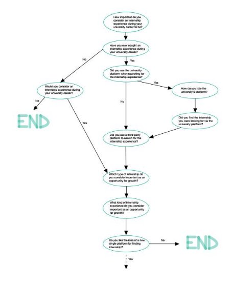

The third section, as already pointed out, is the heart of the questionnaire, the center of our effort to improve the user-experience and enable the success of the platform. In this step we attempt to confirm some functional requirements and extract new ones, to get closer to the needs of the end-users, i.e., the guys who have to make PlaDat a reference point. What better way to enable this than to make them central to the customization. 

- To personalize access to the platform and get closer to users' habits, we ask what types of access are used most by them, to understand which ones to implement and incentivize the use of PlaDat. 

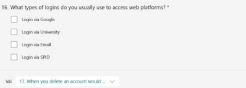

- We, PlaDat team, understand the difficulty of managing the countless online accounts that, nowadays, are an integral part of our identity and, consequently, we camp the need to disconnect from them, eliminating digital accounts. However, we think that a glimmer of rethinking is important both for users and for us, so we want to understand whether the possibility of rethinking is a good feature to include in the web-app: the ultimate choice is up to the kids. 

 

- A third aspect, in my view, that is crucial is to understand how the data should be presented to end-users. In fact, depending on the need, some platforms summarize the data in a tabular format to allow faster comprehension, others prefer a descriptive format, guarantor in highlighting the links between data. We leave, therefore, once again to users the choice of how PlaDat's graphical interfaces should be constructed. 

- Having reached this point, we want to understand what characteristics of internships direct young people to lean toward one offer over another. This is so that we can build PlaDat's functionality in a way that directs companies to enter information related to offers that is consistent and structured with market needs; only in this way will we ensure a platform that is close to the needs of young students. In addition, again with this in mind, we will be able to build ad-hoc bid filtering techniques. 

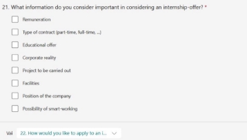

- We also try, in addition, to assist young people in CV construction. To date, in fact, the most common CV interchange format is .pdf; in some cases, however, it is the platform that forces them to use a purpose-built template. In PlaDat we want users to determine the interchange format: either automatically generated from their own data (which requires the effort of re-entering it) or using their personal .pdf CV. In any case, at any rate, we do not want two models to coexist at the same time: we want to standardize the platform to a common standard, going to meet the recruiters who needed to view them. 

 

- Nowadays  recruiters  are  thirsty  for  hiring,  finding  themselves  having  to  manage hundreds of applicants and neglecting, often, feedbacks for the "unselected." As a result, applicants find themselves in a stalemate where they do not understand whether they should wait further for a response or change direction. With this in mind, we want to probe how important students consider feedback to be. If so, we will consider how to bind the company to provide responses to applications, possibly by asking for the ID of the selected student and allowing automatic notification of the remaining. 

 

- Another  aspect  to  consider  is  that  related  to  privacy  and  the  need  to  provide  the individual with the tools to decide how and what personal information to disclose. With this in mind, we want PlaDat to be close to young people in allowing them to choose, as far  as  possible,  what  limits  to  give  companies  in  consulting  data  for  their  profile assessment. There are some data, in fact,  to which people are, for various  reasons, particularly  sensitive  and,  again,  we  want  to  stand  as  a  guarantor  in  this  regard. Important to note is that, compared to the other questions, this one does not need to be filled out; there may be students who have no interest in hiding the data listed. 

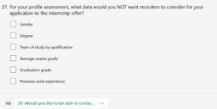

- We conclude the section by trying to understand how to connect parties (students and HR). The problem is to understand what the preferences are in this regard, i.e., whether students want to have the opportunity to contact recruiters directly right away or wait for their profile to be evaluated. In any case, we want to get closer to user habits and understand which communication tool is preferred, from the perspective of both privacy and efficiency in communication. 

 

We summarize the flow of occurrence of questions. 

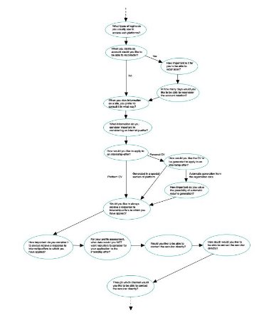

Finally, the fourth and final section is used to adapt the platform according to usage and Internet access habits. Indeed, it is crucial to take into account the devices and browsers that users use to access PlaDat or, more generally, the Internet. In this way we can, once again, come to the aid of students in outlining non-functional requirements and, as a result, attempt to ensure the success of the platform. Very often, in fact, not all  computing devices or  access  platforms support  all  protocols  and  new  versions  of  programming  languages,  which  may  lead  to  a distorted view of the platform, especially if outdated technologies and tools are preferred. 

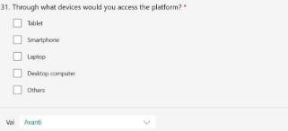 

We summarize the flow of occurrence of questions, which, in this last and simple case, is sequential. 

Of note is that often the questions proposed in this survey are accompanied by others that corroborate their meaning through numerical voting. This allows us to better understand the end-user's interest in that specific aspect and assign an order of importance/rating to the requirements. The rating scale from 1 to 4 is also not random; in fact, it is neither binary, with which the variability of the data is not captured, nor divided into a large scale (such as 1 to 10) that could make it difficult to understand in cases of heterogeneous responses; among other things, the number 4 ensures that we do not have, as in the case of five, a perfectly intermediate response, forcing the student to unbalance. 

**Artifact-driven elicitation: the questionnaire, analysis of results** Having reached this point, finally, let us analyze the results of the questionnaire. 

 

From the results of the first section we understand how our analysis is skewed to one category of students, in that it cannot lead to general considerations about all those enrolled in the university. In fact, almost all respondents are between 18 and 24 years old (an obvious aspect being the population made  up  of  undergraduate  students),  but  not  workers,  commuters,  enrolled  in  a  master's  degree program in Computer Science. 

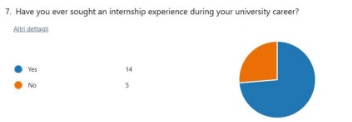

In addition, we can see that students consider internships important (3.32/4 points) and many of them move in the direction of seeking opportunities (about ¾) and of the remaining more than 50% would consider doing an internship. This aspect will help us support the request for funding, even if the data are skewed to master's students in computer science who are required in the three-year period to do internships: it would motivate the high percentage of respondents who sought offers. 

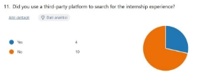

For only half of the students, however, a university's platform is a tool to turn to when looking for an opportunity, and even though, all in all, it is a good platform according to the users, ¾ have not found the internship opportunity through it. This is a very discouraging figure, which must motivate the university to fund a new platform like PlaDat. This is also because ¾ of enrollees do not rely on third- party platforms to search for curricular experiences; therefore, a single channel within the university for internships could be the solution. 

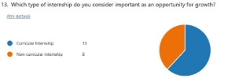 

In addition, students are interested in the most diverse forms of internships, both curricular and non- curricular, which highlights the need for PlaDat: both competitors and the internship portal do not have such varied opportunities, often limited to internships in private companies. 

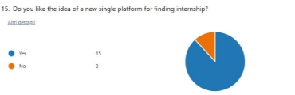

The most encouraging finding for PlaDat is that 90% of respondents would consider a new platform to replace the current ones. Which is encouraging for the success of the web-app and helpful in supporting funding. 

Regarding customization. 

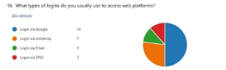

PlaDat needs to provide kids with the ability to at least log in via both Google account and university login, after all, these are students enrolled in university 

 

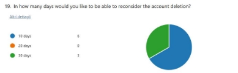

The idea of allowing retrieval within n days of the account has been quite successful, it would be worth considering its inclusion also because, for those who see a need for it, they find it really important to have this feature (2.89/4 points). In addition, it takes only 10 days for respondents to rethink their choice, probably because beyond that time frame, the choice made is unlikely to change. 

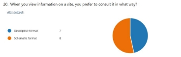

Given the uncertainty about how to display information on the site, we decide that PlaDat will allow two types of views, either descriptive or schematic, an aspect that can be changed from the profile settings. 

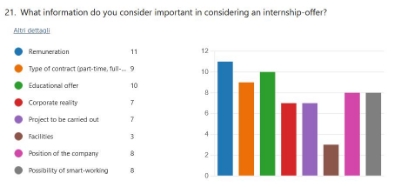

Il formato unico per i CV che sarà presente in PlaDat è il .pdf, preferito dall'80% degli studenti, anche perché per il restante 20% la generazione automatica del CV è di media importanza, il che non motiva il dispiegamento di forze per implementare questa onerosa funzionalità. Tra l'altro, sebbene l'indagine sia skewed  by  computer  science  students  in  the  master's  program,  queste  risposte  possono  essere considerate quasi universali, in quanto dovrebbe essere proprio questa categoria di studenti a preferire un approccio più digitale che, invece, in questo caso, non è gradito, forse perché il formato .pdf lascia maggiore personalizzazione al singolo. 

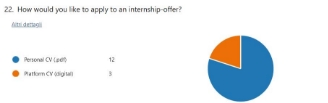 

The unique format for CVs that will be present in PlaDat is the .pdf, preferred by 80 percent of the students, also because for the remaining 20 percent, automatic CV generation is of medium importance, which does not motivate the deployment of forces to implement this onerous functionality. Among other things, although the survey is skewed by computer science students in the master's program, these responses can be considered almost universal, as it should be precisely this category of students who should prefer a more digital approach but, on the contrary, in this case, it is not appreciated, perhaps because the .pdf format leaves more customization to the individual. 

  One aspect present in PlaDat will, certainly, be feedback in case the company has not selected the boy: 100% of the respondents need this information and consider it extremely important (3.8/4). This constraint will be realized as first anticipated: the company will notify PlaDat of the selected student and, automatically, feedback will be generated for the remaining ones. 

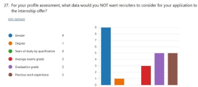

For most students (not all as the question had no compulsory answer) some personal information they consider sensitive. Gender was the most popular, an aspect that reflects a societal problem: there is still too much discrimination in employment on the basis of gender that leads, often, to boys getting jobs over that of their female colleagues. As far as highlighted this data will be hidden from the company, we will  evaluate.  We  will  not  hide,  however,  the  other  data  that,  among  other  things,  have  greater importance in selection. 

 

Another aspect we would keep in mind is to provide, from the outset, a method for contacting the recruiter directly: e-mail. In fact, almost ¾ of people consider this channel as the main one for effective communication, direct communication considered very important (3.08/4) by more than ¾ of the respondents. We will consider, however, how to provide this email, probably after an authorization by HR through explicit request, to ensure privacy to them and, above all, to limit traffic off the platform 

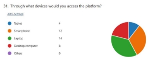 

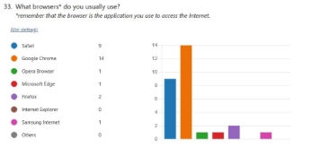

Finally, we will have to design PlaDat so that it works on all screens (users use all Internet access devices) and we will have to ensure compatibility for all those up to 4 years of age. Although most of the respondents have recent devices, it is necessary to consider those up to 4 years old, reaching more than ¾ of the children, also because, the use of updated devices may be related to a need of the respondents who, as repeatedly pointed out, are purely computer scientists studying in master's degree (imbalance highlighted by the first section of the questionnaire). Crucial will be ln testing and implementation of PlaDat at least for Chrome and Safari, which are used by the vast majority of the students. 

**Summary of requirements** 

We summarize, at this point, all PlaDat requirements (functional and nonfunctional) in a table preserving the previously defined local rules.  

|**ID**  |**Type**  |**Description**  |**Priority**  |
| - | - | - | - |
|Functional-Login- GenericUser  |` `Functional Requirements  |` `Users must be able to log into the application.  |` `High  |
|` `Functional- Registration-Student  |` `Functional Requirements  |` `Students must be able to sign into the application.  |` `High  |
|` `Functional- ViewProfile- GenericUser  |` `Functional Requirements  |Users must be able to view their profile.  |` `Middle  |
|` `Functional- DeleteProfile- GenericUser  |` `Functional Requirements  |` `Users must be able to delete their profile.  |` `Middle |
|Functional- ReconsideraAccount- Student|Functional Requirements |Students should be able to reconsider their accounts if they are deleted in 10 days.|Low|
|` `Functional- Registration- Recruiter  |` `Functional Requirements  |` `Recruiters must be able to sign into the application.  |High  |
|` `Functional- UpdateProfile-Student |
` `Functional 

` `Requirements  
|` `Students must be able to update their profile.  |Low |
|` `Functional- UpdateProfile- Recruiter  |` `Functional Requirements  |` `Recruiters must be able to update their profile.  |Low |
|` `Functional- ViewOtherProfile- Student  |` `Functional Requirements  |` `Students must be able to view recruiter-profiles through a schematic format. |` `Middle  |
|` `Functional- ViewOtherProfile- Recruiter  |` `Functional Requirements  |` `Recruiters must be able to view student-profiles.  |Middle  |

|` `Functional- SearchOffers-Student  |` `Functional Requirements  |` `Students must be able to search offers.  |High |
| :- | :- | :- | - |
|` `Functional-ViewOffer- Student  |` `Functional Requirements  |Students must be able to view the information of an offer through a schematic format. |High  |
|` `Functional- ViewOffers-Student  |` `Functional Requirements  |Students must be able to view which offers they applied and the status.  |High  |
|` `Functional- ApplyOffer-Student  |` `Functional Requirements  |` `Students must be able to apply to an offer.  |` `High  |
|` `Functional- CreateOffer-Recruiter  |` `Functional Requirements  |` `Recruiters must be able to create an offer.  |High  |
|` `Functional-ViewOffer- Recruiter  |` `Functional Requirements  |Recruiters must be able to view the information of an offer and who applied.  |High  |
|Functional- ViewOffers-Recruiter |` `Functional Requirements |Recruiters must be able to view their offers. |High  |
|` `Functional- UpdateOffert- Recruiter  |Functional Requirements |Recruiters must be able to update their offers.  |Low  |
|Functional-CloseOffer- Recruiter |Functional Requirements  |` `Recruiters must be able to close their offers after responding to all candidates.  |Middle |
|Functional- UpdateStatus- Recruiter  |` `Functional Requirements |Recruiters must be able to update the status of a student's application.  |High |
|Functional- ApplyInternshipOffer- Student|Functional Requirements|The student must be able to apply for the internship-offer by sending a personal CV|Middle|
|Fuctional- DirectMessage-Student|Functional Requirements|The students must be able to contact recruiters directly|Middle|
|NonFunctional- Performance- GTmetrixGrade|Non Functional Requirements|To ensure competitiveness and performance, the application must exceed or equal GTMetrix grade B.|Middle|
|NonFunctional- Compliance-HTTPS|Non Functional Requirements|To align with the European GDPR standard, PlaDat must provide access via HTTPS.|High|
|NonFunctional- Compliance-AES256|Non Functional Requirements|To align with the European GDPR standard, PlaDat must provide AES-256 symmetric data encryption.|High|
|NonFunctional- Compliance- Redundancy|Non Functional Requirements|To align with the European GDPR standard, PlaDat must have the data rooted on at least two servers.|High|
|NonFunctional- Accessibility- Responsive|Non Functional Requirements|To ensure adequate accessibility, I create software that is responsive for the devices that will be used.|High|
|NonFunctional- Accessibility- DistributedSystem|Non Functional Requirements|The at least two servers defined by the NonFunctional- Compliance-Redundancy requirement must be deployed in two different locations to avoid the problems associated with disasters.|Middle|
|NonFunctional- Availability- LoadBalancing|Non Functional Requirements|To ensure adequate availability, we need to create software that rests on Kubernates.|Middle|
|NonFunctional- Usability- SessionAuthentication|Non Functional Requirements|To ensure adequate usability, we need to create software that makes statefull HTTPS for authentication.|High|
**Useful Links** 

We report **useful links** to PlaDat here: 

- Link a **GitLab** repository [https://gitlab.com/mattiapiazzalunga/2022_assignment2_pladat;](https://gitlab.com/mattiapiazzalunga/2022_assignment2_pladat)  
- Link to the **questionnaire** (settings have been changed to allow viewing and editing in the  correction,  please  contact  us  if  you  have  problems [m.piazzalunga2@campus.unimib.it)](mailto:m.piazzalunga2@campus.unimib.it): [https://forms.office.com/Pages/DesignPageV2.aspx?subpage=design&FormId=VH- yMvsJr0icFw- YpdWYv44GRLgBsNxJr_dMfYOwmG5URVU5WEZENldJNlRPNjVXVEdOT0hZNE5FWC4 u&Token=70b5c82644924afd96a3c76f533a301d](https://forms.office.com/Pages/DesignPageV2.aspx?subpage=design&FormId=VH-yMvsJr0icFw-YpdWYv44GRLgBsNxJr_dMfYOwmG5URVU5WEZENldJNlRPNjVXVEdOT0hZNE5FWC4u&Token=70b5c82644924afd96a3c76f533a301d)

**Team members** 

We report **team members**: 

- Mattia Piazzalunga – 851931 
- Matteo Severgnini – 851920 

--- THE END --- 